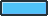

# Bouncy Ball Survival

Keep a bouncy ball bouncing in the air with your paddle. Don't let your paddle get destroyed!

## Ingredients

* Entities

    * Ball

    * Missile

    * Paddle

* States

    * PlayState

* Images

    

    

    

## main.lua

> ### Setting the controls and the first state

__BlankE.load()__

```
Input.set("move_left", "left", "a")
Input.set("move_right", "right", "d")
Input.set("move_up","up", "w")
Input.set("move_down","down", "s")
Input.set("restart","r")

BlankE.options.state = "PlayState"
```

## Entity -> Ball

> ### __look like a bouncy ball _(drawing the ball image)___

__init()__

1. add the image of a ball `self.img_ball = Image("ball")`

2. change the image offset to the center of the image

```
self.img_ball.xoffset = self.img_ball.width / 2
self.img_ball.yoffset = self.img_ball.height / 2
```

__update(dt)__

1. move the ball image to the Ball object's position

```
self.img_ball.x = self.x
self.img_ball.y = self.y
```

__draw()__

1. We can't forget to actually draw the ball image `self.img_ball:draw()`


> ### __fall towards the bottom of the screen _(affected by gravity)___

__init()__

1. give Ball some gravity `self.gravity = 6`

> ### __bounce on the player's paddle _(has a hitbox and collision event)___

__init()__

1. add a hitbox `self:addShape('main','circle',{0,0,self.img_ball.width/2})`

    NOTE: The _main_ hitbox is a circle with a radius equal to half the width of the ball image. It doesn't matter if you use the image's width or height here since the image's width and height are the same (32 x 32)

__update(dt)__

1. bounce when Ball hits a paddle

```
self.onCollision['main'] = function(other)
    if other.parent.classname == "Paddle" then
        self:collisionBounce(1.01)
        -- this will cause the ball to move slightly left or right depending on where it hits the paddle
        self.hspeed = self.hspeed + (self.x - other.x)
        -- will be used later for keeping score
        Signal.emit("ball_hit_paddle")
    end
end
```

NOTE: we'll use that Signal emission later for scoring

> ### __bounce off the screen wall (keep the ball inside the screen)__

__update(dt)__

1. if the ball gets too close to the screen edges, flip its horizontal speed to have it go in the opposite direction

```
if self.x < 0 or self.x > game_width then
    self.hspeed = -self.hspeed
end
```

That should be everything we need for Ball!

## Entity -> Paddle

Paddle behavior:

> ### Draw a paddle!

__init()__

1. add the image of a paddle `self.img_paddle = Image("paddle")`

2. change the image offset to the center of the image

```
self.img_paddle.xoffset = self.img_paddle.width / 2
self.img_paddle.yoffset = self.img_paddle.height / 2
```

3. give the Paddle friction so it won't move in one direction forever `self.friction = 0.4`

4. add a hitbox `self:addShape("main","rectangle",{0,0,self.img_paddle.width self.img_paddle.height})`

__draw()__

1. Draw the paddle image `self.img_paddle:draw()`

> ### Move left and right when the player presses those keys

__update(dt)__

1. determine how fast it will move `local move_spd = 800`

2. watch for key presses and move the paddle in the direction the player presses

```
if Input("move_left").pressed then
    self.hspeed =	-move_spd
end
if Input("move_right").pressed then 
    self.hspeed =	move_spd 
end 
if Input("move_down").pressed then
    self.vspeed =	move_spd 
end
if Input("move_up").pressed then
    self.vspeed =	-move_spd
end
```

NOTE: Creating the __move_spd__ variable is good practice instead of typing __800__ every time. If we test the game and realize the paddle moves too quickly, we can easily change the value of __move_spd__ instead of changing everywhere we typed __800__.

3. move the paddle image

```
self.img_paddle.x = self.x 
self.img_paddle.y = self.y
```

> ### Wrap the paddle around the edges of the game

__update(dt)__

1. check if it is out of bounds horizontally

```
if self.x > game_width then
		
end
if self.x < 0 then

end
```

2. 'teleport' it to the other side of the screen, if it goes out of bounds

```
if self.x > game_width then
    self.x = 0
end
if self.x < 0 then
    self.x = game_width
end
```

> ### Blow up the paddle when a Missile hits it

__update(dt)__

1. explode on contact with missile

```
self.onCollision["main"] = function(other)
    if other.parent.classname == "Missile" then
        self:explode()
    end
end
```

__explode()__

```
function Paddle:explode()

end
```

1. set a flag and check it so that the paddle can't explode again

```
if self.exploded then return end
self.exploded = true
```

2. break the paddle image into pieces `self.img_paddle_pcs = self.img_paddle:chop(8,5)`

3. throw them in random directions

```
local opp_direction = self.img_paddle.angle + 180
self.img_paddle_pcs:forEach(function(piece)
    local direction = randRange(opp_direction - 45, opp_direction + 45)
    piece.hspeed = direction_x(direction, 20)
    piece.vspeed = direction_y(direction, 20)
end)
Signal.emit("paddle_explode")
```

4. remove the hitbox so that it seems like it's actually exploded and gone

`self:removeShape("main")`

5. after some time, destroy the object

```
Timer.after(3, function()
    self:destroy()
end)
```

__draw()__

1. draw the pieces

```
if self.img_paddle_pcs then
    self.img_paddle_pcs:call('draw')
end
```

2. hide the old image if it's exploded

~~`self.img_paddle:draw()`~~

```
if self.img_paddle_pcs then
    self.img_paddle_pcs:call('draw')
else
    self.img_paddle:draw()
end
```

## Entity -> Missile

Missile behavior:

> ### Draw a missile

__init()__ 

1. add missile image `self.img_missile = Image("missile")`

2. center it

```
self.img_missile.xoffset = self.img_missile.width / 2
self.img_missile.yoffset = self.img_missile.height / 2
```

__update(dt)__

1. move it to the current position

```
self.img_missile.x = self.x
self.img_missile.y = self.y
```

2. rotate the image to match the direction it's moving in `self.img_missile.angle = self.direction + 90`


__draw()__

1. draw it `self.img_missile:draw()`


> ### Make it a homing missile that follows the Paddle

__update(dt)__

1. if there is a paddle, move towards it

```
local paddle = Paddle.instances[1]
if paddle and self.homing then
    self:moveTowardsPoint(paddle.x, paddle.y, 100)
end
```

__init()__

1. after 10 seconds, stop homing in on the Paddle

```
self.homing = true
Timer.after(10, function()
    self.homing = false
end)
```

> ### ...and wait 3 seconds before moving

We want to give the player a chance to respond to these missiles before they become deadly (having a hitbox). This new code wil replace the __init()__ code from the previous step.

__init()__

1. make the missile non-homing when it spawns `self.homing = false`

2. have the missile fade in while it's "charging up"

```
self.img_missile.alpha = 0
Tween(self.img_missile, {alpha=1}, 3, "linear", function()

end):play()
```

3. at the end of the tween, set the missile to homing

```
self.img_missile.alpha = 0
Tween(self.img_missile, {alpha=1}, 3, "linear", function()
    self.homing = true
    Timer.after(10, function()
        self.homing = false
    end)
end):play()
```

__init()__

> ### Destroy the missile if it touches the Paddle or the screen edges

__init()__

1. give it a hitbox `self:addShape("main","rectangle",{0,0,self.img_missile.width,self.img_missile.height})`

__update(dt)__

2. call our custom explode() method during a collision

```
-- call our custom explode() method during a collision
self.onCollision["main"] = function(other)
    if other.parent.classname == "Paddle" and self.homing then
        self:explode()
    end
end	
```

> ### Make the missile explosion look cool

__explode()__ (create another explosion method)

1. break the missile image into pieces `local img_missile_pcs = self.img_missile:chop(5,5)`

2. throw them in the opposite direction 

```
local opp_direction = self.img_missile.angle + 180
self.img_missile_pcs:forEach(function(piece)
    local direction = randRange(opp_direction - 45, opp_direction + 45)
    piece.hspeed = direction_x(direction, 20)
    piece.vspeed = direction_y(direction, 20)
end)
Signal.emit("paddle_explode")
```

3. remove the hitbox so that it seems like it's actually exploded and gone

`self:removeShape("main")`

4. after some time, destroy the object

```
Timer.after(3, function()
    self:destroy()
end)
```

__draw()__

1. draw the pieces

```
if self.img_missile_pcs then
    self.img_missile_pcs:call('draw')
end
```

2. hide the old image if it's exploded

~~`self.img_missile:draw()`~~

```
if self.img_missile_pcs then
    self.img_missile_pcs:call('draw')
else
    self.img_missile:draw()
end
```

## State -> PlayState

What will happen in this State?

> ### Set up the game

__before enter()__

1. Declare some local variables that will hold our paddle and ball`local ent_paddle, ent_ball`

__enter()__

1. Spawn the Paddle `ent_paddle = Paddle()`

2. Spawn a Ball `ent_ball = Ball()`

3. Move the Ball to the top-middle of the screen

```
ent_ball.x = game_width / 2
ent_ball.y = 50
```

4. Move the Paddle to the center of the screen

```
ent_paddle.x = game_width / 2
ent_paddle.y = game_height / 2
```

5. Spawn a missile every 5 seconds in a random spot

```
Timer.every(5, function()
    local rand_missile = Missile()
    rand_missile.x = randRange(50, game_width - 50)
    rand_missile.y = randRange(50, game_height - 50)
end)
```

6. Set the score to 0 `score = 0`

__draw()__

1. Draw the Paddle and Ball

```
ent_paddle:draw()
ent_ball:draw()
```

2. Draw missiles `Missile.instances:call('draw')`

> ### Handle the scoring

__before enter()__

1. Add a local variable `local ent_paddle, ent_ball, score`

__enter()__

1. Every time the ball hits the paddle, increment the score. This will use the Signal we emitted earlier

```
Signal.on("ball_hit_paddle",function()
    score = score + 1
end)
```

__draw()__

1. Draw the score `Draw.text("SCORE: "..tostring(score), 20, 20)`

> ### End the game when the paddle breaks or the ball drops

__before enter()__

1. Add local variable `local ent_paddle, ent_ball, score, game_over`

__enter()__

1. Set up game status variable `game_over = false`

2. End game if paddle explodes 

```
Signal.on("paddle_explode",function()
    game_over = true
end)
```

__update(dt)__

1. End game if ball drops

```
if ent_ball.y > game_height then
    ent_ball:destroy()
    ent_paddle:explode()
end
```

> ### Handle game over stuff

__update(dt)__

1. if the game is over, check if the player wants to restart

```
if game_over and Input("restart").released then
    State.switch("PlayState")
end
```

__draw()__

2. draw game over text

```
if game_over then
    Draw.text("GAME OVER", 0, game_height/2, {align="center"})
end
```